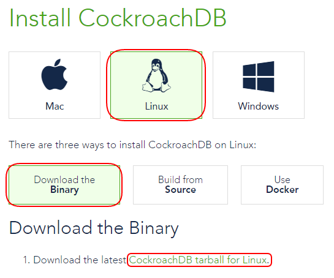

## Create the Working Directory

This is the directory we will be starting the cluster from but it will not hold the virtual machines. They will get placed in the Default Machine Folder as specified by VirtualBox.

1. On the host machine, create a directory to hold the Vagrant base box and other configuration files. It can be created anywhere and called anything you like. This guide calls the working directory `cockroach-vb-cluster`.


## Download the Vagrant Base Box

The zip file containing the Vagrant base box and it's configuration files is stored in an S3 bucket on AWS (Amazon Web Services). It's a little over 600 Mb in size.

1. Download the [cockroach-vb-cluster.zip](https://s3.amazonaws.com/cockroach-vb-cluster/cockroach-vb-cluster.zip) at https://s3.amazonaws.com/cockroach-vb-cluster/cockroach-vb-cluster.zip.

2. Place the `cockroach-vb-cluster.zip` file into the `cockroach-vb-cluster` directory and unzip. (Check the unzip utility doesn't add the name of the zip file to the directory location or you will end up with `cockroach-vb-cluster\cockroach-vb-cluster`.) The zip file contains the Vagrant box file and other configuration scripts.


## Add the CockroachDB Box to Vagrant

1. On the host machine, at the command prompt, in the `cockroach-vb-cluster` direcory, execute the `vagrant box add --name CockroachDB CockroachDB.box` command.

   ```Shell
   cockroach-vb-cluster> vagrant box add --name CockroachDB CockroachDB.box
   ==> box: Box file was not detected as metadata. Adding it directly...
   ==> box: Adding box 'CockroachDB' (v0) for provider:
       box: Unpacking necessary files from: file://cockroach-vb-cluster/CockroachDB.box
       box: Progress: 100% (Rate: 906M/s, Estimated time remaining: --:--:--)
   ==> box: Successfully added box 'CockroachDB' (v0) for 'virtualbox'!
   
   cockroach-vb-cluster>
   ```
   This will add the box to your Vagrant configuration and make it available to start new machines with.

2. Use the `vagrant box list` command to show the available boxes.

   ```Shell
   cockroach-vb-cluster>vagrant box list
   CockroachDB (virtualbox, 0)
   
   cockroach-vb-cluster>
   ```
   

## Configure the Vagrantfile (optional)

One of the configuration files is the `Vagrantfile` used to configure the cluster. It will work without modification but you may want to change the amount of memory and number of virtual CPUs allocated to each virtual machine based on the size of your host machine and the number of cluster nodes you intend on using.

{{site.data.alerts.tip}}
On Windows, you can quickly open a command prompt in the desired directory by holding down shift key and right-clicking the folder name in the Windows File Manager, then choose "Open command window here".
{{site.data.alerts.end}}

1. Edit the `Vagrantfile` file in the `cockroach-vb-cluster` directory to adjust the `vb.memory` and `vb.cpus` parameters as required. (optional)

   ```Shell
   #  The amount of memory for each cluster node.
   #  The practical maximum depends on the amount of physical memory on your host
   #  and the number of cluster nodes.
   #
   vb.memory = 1024
            
   #  The number of virtual CPUs allocated to each cluster node.
   #  The practical maximum depends on the amount of physical cores on your host
   #  and the number of cluster nodes.  
   #
   vb.cpus = 2
   ```


## Change the Machine Time Zone (optional)

The `CockroachDB` box has it’s time set to **UTC** by default. If you want to set all your CockroachDB machine nodes to your local time zone, add the following code anywhere to the `node_provision.bash` script substituting `Pacific/Auckland` for your desired time zone from one in the `/usr/share/zoneinfo` directory.

```Shell
rm -f /etc/localtime
ln -s /usr/share/zoneinfo/Pacific/Auckland /etc/localtime
```

If you leave the time zone at **UTC** but still want to see timestamps on the cluster nodes in your local time, set and export the **TZ** environment variable to your desired time zone.

For example:

```Shell
[roachdb@nodeA ~]$ date
Wed Mar 2 02:31:40 UTC 2016
[roachdb@nodeA ~]$ export TZ=Pacific/Auckland
[roachdb@nodeA ~]$ date
Wed Mar 2 15:31:55 NZDT 2016
[roachdb@nodeA ~]$
```

There is no Linux based time synchronization like **NTP** running on the cluster nodes to keep their time in sync. The VirtualBox Guest Additions ensure that the guest’s system time is kept in sync with the host machine’s time. There are a number of timesync parameters that can be adjusted using the `VBoxManage` command if necessary.


## Download the CockroachDB pre-built binary

{{site.data.alerts.important}}
The pre-built binary version will probably be different to the one used in the instructions below. Adjust the filename accordingly.
{{site.data.alerts.end}}

1. Open a web browser on your host machine and go to the [Install CockroachDB](https://www.cockroachlabs.com/docs/install-cockroachdb.html) `https://www.cockroachlabs.com/docs/install-cockroachdb.html` page, select **Linux** and **Download the Binary**. Click the **CockroachDB tarball for Linux** link.

   Save the .tgz file into the `cockroach-vb-cluster` directory.
   


## What's Next?

Next, we will [start the cluster](cockroach-vb-cluster_create_cockroachdb_cluster).
