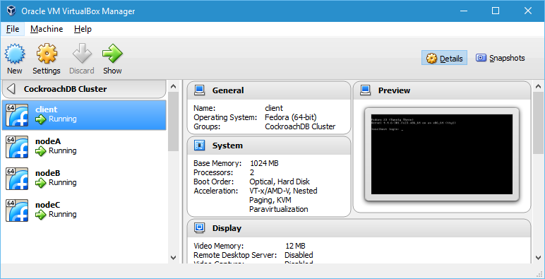

## Cluster Startup
  
There are 27 machines defined in the cluster Vagrantfile, that is, 26 cluster nodes named **node[A-Z]** and a client machine named **client**.

Executing the `vagrant up` command in the `cockroach-vb-cluster` directory will only, by default, start the client machine and the first three nodes **(node[A-C])**. This is done to start a minimum sized cluster (3 nodes) by default while still giving you the ability to start/stop the other 23 nodes manually.

{{site.data.alerts.note}}
You don't need to run the vagrant init command as the configuration files contain a pre-configured Vagrantfile ready to go.
{{site.data.alerts.end}}

1. On the host machine, in the `cockroach-vb-cluster` directory, at the command prompt, execute the `vagrant up` command. This will start the client machine and the first 3 nodes by default. On the first boot it will also re-install the VirtualBox Guest Additions to match the version of VirtualBox if required.

```Shell
cockroach-vb-cluster> vagrant up
Bringing machine 'client' up with 'virtualbox' provider...
Bringing machine 'nodeA' up with 'virtualbox' provider...
Bringing machine 'nodeB' up with 'virtualbox' provider...
Bringing machine 'nodeC' up with 'virtualbox' provider...
==> client: Importing base box 'CockroachDB'...
==> client: Matching MAC address for NAT networking...
==> client: Setting the name of the VM: client
==> client: Clearing any previously set network interfaces...
==> client: Preparing network interfaces based on configuration...
    client: Adapter 1: nat
    client: Adapter 2: hostonly
==> client: Forwarding ports...
    client: 22 (guest) => 2222 (host) (adapter 1)
==> client: Running 'pre-boot' VM customizations...
==> client: Booting VM...
==> client: Waiting for machine to boot. This may take a few minutes...
    client: SSH address: 127.0.0.1:2222
    client: SSH username: roachdb
    client: SSH auth method: private key
==> client: Machine booted and ready!
==> client: Checking for guest additions in VM...
==> client: Setting hostname...
==> client: Configuring and enabling network interfaces...
==> client: Mounting shared folders...
    client: /vagrant => C:/Users/uptime/Documents/cockroach-vb-cluster
==> client: Running provisioner: shell...
    client: Running: C:/Users/uptime/AppData/Local/Temp/vagrant-shell20160415-6128-1pd0ci0.bash
==> client: Fedora release 23 (Twenty Three)
==> client: Installing latest CockroachDB pre-built binary
==> client: Creating SSL certificates in /home/roachdb/certs
==> client: Generated CockroachDB man pages in man/man1/
==> nodeA: Importing base box 'CockroachDB'...
==> nodeA: Matching MAC address for NAT networking...
==> nodeA: Setting the name of the VM: nodeA
==> nodeA: Fixed port collision for 22 => 2222. Now on port 2200.
==> nodeA: Clearing any previously set network interfaces...
==> nodeA: Preparing network interfaces based on configuration...
    nodeA: Adapter 1: nat
    nodeA: Adapter 2: hostonly
==> nodeA: Forwarding ports...
    nodeA: 22 (guest) => 2200 (host) (adapter 1)
==> nodeA: Running 'pre-boot' VM customizations...
==> nodeA: Booting VM...
==> nodeA: Waiting for machine to boot. This may take a few minutes...
    nodeA: SSH address: 127.0.0.1:2200
    nodeA: SSH username: roachdb
    nodeA: SSH auth method: private key
==> nodeA: Machine booted and ready!
==> nodeA: Checking for guest additions in VM...
==> nodeA: Setting hostname...
==> nodeA: Configuring and enabling network interfaces...
==> nodeA: Mounting shared folders...
    nodeA: /vagrant => C:/Users/uptime/Documents/cockroach-vb-cluster
==> nodeA: Running provisioner: shell...
    nodeA: Running: C:/Users/uptime/AppData/Local/Temp/vagrant-shell20160415-6128-qq8808.bash
==> nodeA: Fedora release 23 (Twenty Three)
==> nodeA: Installing latest CockroachDB pre-built binary
==> nodeA: Creating SSL certificates in /home/roachdb/certs
==> nodeA: Generated CockroachDB man pages in man/man1/
==> nodeB: Importing base box 'CockroachDB'...
==> nodeB: Matching MAC address for NAT networking...
==> nodeB: Setting the name of the VM: nodeB
==> nodeB: Fixed port collision for 22 => 2222. Now on port 2201.
==> nodeB: Clearing any previously set network interfaces...
==> nodeB: Preparing network interfaces based on configuration...
    nodeB: Adapter 1: nat
    nodeB: Adapter 2: hostonly
==> nodeB: Forwarding ports...
    nodeB: 22 (guest) => 2201 (host) (adapter 1)
==> nodeB: Running 'pre-boot' VM customizations...
==> nodeB: Booting VM...
==> nodeB: Waiting for machine to boot. This may take a few minutes...
    nodeB: SSH address: 127.0.0.1:2201
    nodeB: SSH username: roachdb
    nodeB: SSH auth method: private key
==> nodeB: Machine booted and ready!
==> nodeB: Checking for guest additions in VM...
==> nodeB: Setting hostname...
==> nodeB: Configuring and enabling network interfaces...
==> nodeB: Mounting shared folders...
    nodeB: /vagrant => C:/Users/uptime/Documents/cockroach-vb-cluster
==> nodeB: Running provisioner: shell...
    nodeB: Running: C:/Users/uptime/AppData/Local/Temp/vagrant-shell20160415-6128-azv304.bash
==> nodeB:
==> nodeB: Fedora release 23 (Twenty Three)
==> nodeB: Installing latest CockroachDB pre-built binary
==> nodeB: Creating SSL certificates in /home/roachdb/certs
==> nodeB: Generated CockroachDB man pages in man/man1/
==> nodeC: Importing base box 'CockroachDB'...
==> nodeC: Matching MAC address for NAT networking...
==> nodeC: Setting the name of the VM: nodeC
==> nodeC: Fixed port collision for 22 => 2222. Now on port 2202.
==> nodeC: Clearing any previously set network interfaces...
==> nodeC: Preparing network interfaces based on configuration...
    nodeC: Adapter 1: nat
    nodeC: Adapter 2: hostonly
==> nodeC: Forwarding ports...
    nodeC: 22 (guest) => 2202 (host) (adapter 1)
==> nodeC: Running 'pre-boot' VM customizations...
==> nodeC: Booting VM...
==> nodeC: Waiting for machine to boot. This may take a few minutes...
    nodeC: SSH address: 127.0.0.1:2202
    nodeC: SSH username: roachdb
    nodeC: SSH auth method: private key
==> nodeC: Machine booted and ready!
==> nodeC: Checking for guest additions in VM...
==> nodeC: Setting hostname...
==> nodeC: Configuring and enabling network interfaces...
==> nodeC: Mounting shared folders...
    nodeC: /vagrant => C:/Users/uptime/Documents/cockroach-vb-cluster
==> nodeC: Running provisioner: shell...
    nodeC: Running: C:/Users/uptime/AppData/Local/Temp/vagrant-shell20160415-6128-1bw6k8j.bash
==> nodeC:
==> nodeC: Fedora release 23 (Twenty Three)
==> nodeC: Installing latest CockroachDB pre-built binary
==> nodeC: Creating SSL certificates in /home/roachdb/certs
==> nodeC: Generated CockroachDB man pages in man/man1/

cockroach-vb-cluster>
```

A 3 node cluster and a client machine should now be up and running!


## About the CockroachDB Cluster Group

The Vagrantfile creates a VirtualBox group called `CockroachDB Cluster` and places all the machines into that group to keep them all together. You can see this group in the VirtualBox VM Manager but note that if have the VirtualBox VM Manager already open when you execute the `vagrant up` command, you will see the machines appear without a group. 

You have to restart the VM Manager in order to see your machines in the `CockroachDB Cluster` group. You can restart the VM Manager while virtual machines are up and running without a problem.




## Starting the Other Cluster Nodes (optional)

The nodes automatically started can be altered by editing the `:autostart` parameter for the node in the nodes array in the `Vagrantfile` file.

```Shell
nodes = \[
{ :name => "client", :ip => "10.10.10.200", :autostart => "true", },
{ :name => "nodeA",  :ip => "10.10.10.111", :autostart => "true", },
{ :name => "nodeB",  :ip => "10.10.10.112", :autostart => "true", },
{ :name => "nodeC",  :ip => "10.10.10.113", :autostart => "true", },
{ :name => "nodeD",  :ip => "10.10.10.114", :autostart => "false", },
{ :name => "nodeE",  :ip => "10.10.10.115", :autostart => "false", },
<<output snip>>
```

The other 23 nodes can be started/stopped easily using a regular expression passed to the `vagrant up` command. Any node name surrounded by forward slashes is assumed to be a regular expression.

For example; to start three more nodes (nodeD, nodeE, and nodeF), in the `cockroach-vb-cluster` directory, on the command line in the host machine, execute the command: `vagrant up /node[D-F]/`

{{site.data.alerts.warning}}
This regular expression functionality seems to be broken in Vagrant 1.8.1. (issue \#6828). It appears to have been fixed in the next release.
As a work-around issue the `vagrant up` command with the `--no-install-provider` flag.
For example: `vagrant up --no-install-provider /node[D-F]/` should work.
{{site.data.alerts.end}}

{{site.data.alerts.note}}
It takes about 35 minutes to start the 27 machines for the first time on my host machine, with each node configured with 1Gb memory and 1 CPU.
It takes about 3 - 4 minutes to start the 4 default machines. YMMV.
{{site.data.alerts.end}}

## Check the Status of the Cluster

1. Use the `vagrant status` command to check that the client machine and the first three cluster nodes are running.

   ```Shell
   cockroach-vb-cluster> vagrant status
   Current machine states:

   client                    running (virtualbox)
   nodeA                     running (virtualbox)
   nodeB                     running (virtualbox)
   nodeC                     running (virtualbox)
   nodeD                     not created (virtualbox)
   nodeE                     not created (virtualbox)
   nodeF                     not created (virtualbox)
   nodeG                     not created (virtualbox)
   nodeH                     not created (virtualbox)
   nodeI                     not created (virtualbox)
   nodeJ                     not created (virtualbox)
   nodeK                     not created (virtualbox)
   nodeL                     not created (virtualbox)
   nodeM                     not created (virtualbox)
   nodeN                     not created (virtualbox)
   nodeO                     not created (virtualbox)
   nodeP                     not created (virtualbox)
   nodeQ                     not created (virtualbox)
   nodeR                     not created (virtualbox)
   nodeS                     not created (virtualbox)
   nodeT                     not created (virtualbox)
   nodeU                     not created (virtualbox)
   nodeV                     not created (virtualbox)
   nodeW                     not created (virtualbox)
   nodeX                     not created (virtualbox)
   nodeY                     not created (virtualbox)
   nodeZ                     not created (virtualbox)

   This environment represents multiple VMs. The VMs are all listed
   above with their current state. For more information about a specific
   VM, run `vagrant status NAME`.

   cockroach-vb-cluster>
   ```


## About the Client Machine

There is nothing special about this machine, in fact it's built from the same image as all the other nodes. It's purpose is to not run a CockroachDB instance, but to be used as a place to connect to the cluster from and run shell scripts etc.


## Linux Man Pages

CockroachDB comes with a command to generate entries in `man` for the database.

These have been generated and installed into the `/usr/local/share/man/man1/` directory on each cluster node by the `node_provision.bash` script. On any node or the client machine you can refer to them using the `man cockroach` command.

See the SEE ALSO section in the man page for other available commands.


## What's Next?

We can now [log onto a node](cockroach-vb-cluster_log_on_to_a_node).
