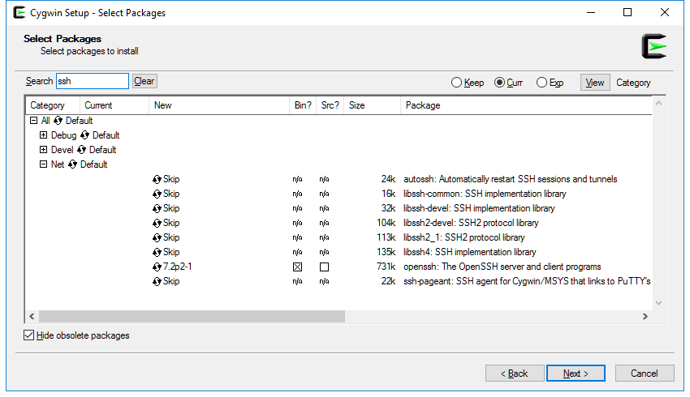

You will need Administrator privilege on your Windows host to install Cygwin.

## Download Cygwin
Windows 

1. Go to the [Cygwin Website](https://cygwin.com/) and download the `setup-x86_64.exe` (for 64 bit Windows) or `setup-x86.exe` (for 32 bit Windows).
Save this file somewhere like the Downloads folder.

## Install Cygwin
Windows 

1. Double-click on the setup executable to start the installation.

   - At the **Cygwin Setup** window, click `Next >`

   - At the **Cygwin Setup - Choose Installation Type** window, select `Install from Internet`. Click `Next >`.

   - At the **Cygwin Setup - Choose Installation Directory** window, enter `C:\cygwin64` or `C:\cygwin32` in the Root Directory box. Select Install For All Users. Click `Next >`.
  
   - At the **Cygwin Setup - Select Local Package Directory** window, enter a temporary location like `C:\temp` in the Local Package Directory box. Click `Next >`.

   - At the **Cygwin Setup - Select Connection Type** window, select `Direct Connection` or one of the other methods if you go through a Proxy. Click `Next >`.

   - At the **Cygwin Setup - Choose Download Site(s)** window, select the download site cloest to you or one at random if you're not sure. Click `Next >`.

   - Cygwin Set will download the files and open the Cygwin Setup - Select Packages window.

   - At the **Cygwin Setup - Select Packages** window, open the Net category and click on the word Skip on the `openssh` line. This will select the openssh package and related dependencies to be installed. Click `Next >` to begin the installation.

   

## Configure Cygwin
Windows 

In addition to the ssh package installed, the default set of packages installed with Cygwin will give you basic Linux commands at the Windows command prompt. The only configuration required is to add Cygwin to your PATH.

### Add Cygwin to your PATH
Windows 

1. Put `C:\cygwin64\bin` in your **%PATH%** environment variable so the ssh command (and other useful Linux commands) can be found.
Google for instructions on how to add a directory to your PATH if you don't know how to do this.

## What's Next?

Install [VirtualBox](cockroach-vb-cluster_virtualbox) on your host machine.
