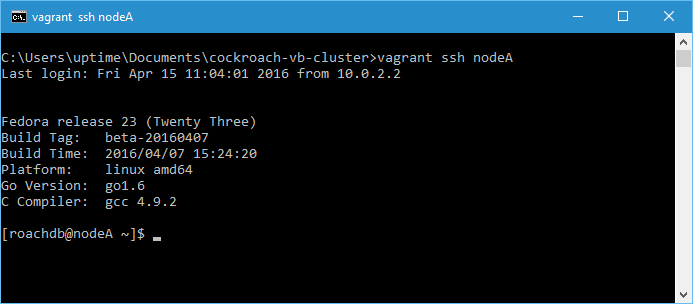
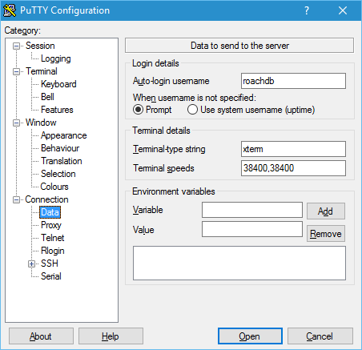
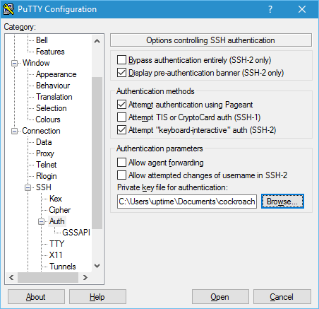
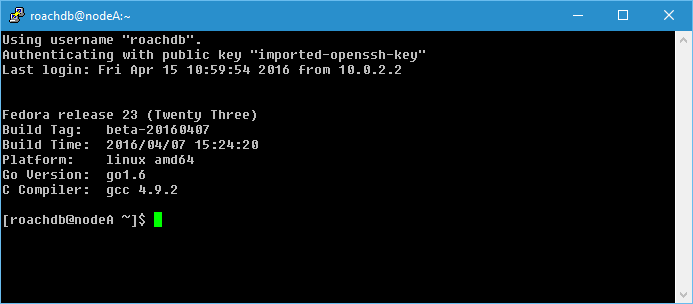
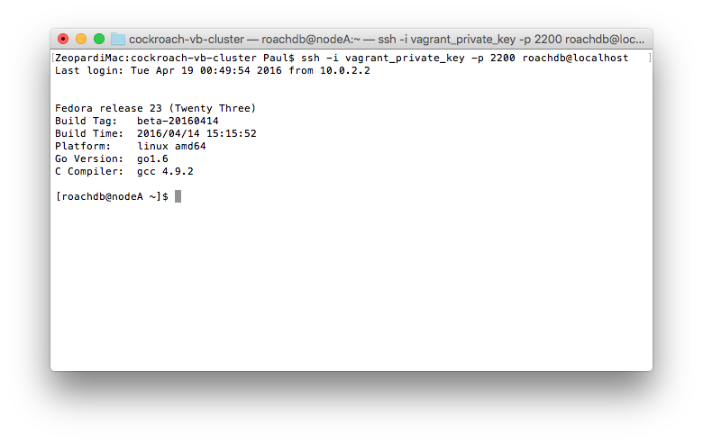

Logging onto to a cluster node is available via SSH on port 22 to the IP address of the machine using the VirtualBox Host-only network (192.168.56.0) from the host machine.

The same instructions apply to the client machine.


## Using Vagrant SSH
<span class="label label-info">Windows</span><span class="label label-success">Mac</span><span class="label label-warning">Linux</span>

This is a multi-machine Vagrant configuration so when you SSH to a particular node using the `vagrant` command, you need to specify the node on the command line.

1. From a command prompt on the host machine, in the `cockroach-vb-cluster` directory, execute the `vagrant ssh <hostname>` command. 

   You will be logged into a bash shell on that node as the `roachdb` user.

   For example, to connect to nodeA

   

   The terminal will display the operating system and CockroachDB version.


## Using Putty
<span class="label label-info">Windows</span>

[PuTTY](http://www.putty.org/) is a great terminal emulator for Windows but it isn't compatible with the OpenSSL style of SSH keys that Vagrant generates. However, it does provide a utility called `PuTTYgen` that can convert the OpenSSL keys into PuTTy's key format which can then be used to connect to the cluster nodes.

The configuration files downloaded previously contains a file called `cockroach-vb-cluster.ppk` generated with the PuTTYgen utility. This is the Vagrant private key converted from OpenSSL format into PuTTy's key format. It can be used to create a SSH PuTTY session that uses SSH key pair authenication.


### Create a PuTTY session using the key

1. In the PuTTY Configuration window, go to `Connection --> SSH --> Auth` and click the `Bowse` button next the the `Private key file for authentication:` field. Find and select the `cockroach-vb-cluster.ppk` file created above. Login as the roachdb user. You should not be prompted for a password as it should say `Authenticating with public key "imported-openssh-key"`.

   

   
   
   When you open the session, you should be automatically logged into the `roachdb` user without a password using the key pair.

   

{{site.data.alerts.tip}}
Each cluster node uses the default vagrant SSH key pair so after you have set up one PuTTy session, all you need to do to create others is change the forwarded port number.
{{site.data.alerts.end}}


## Using Mac OS X Terminal
<span class="label label-success">Mac</span>

You can use the Mac OS X Terminal to log onto the cluster nodes using SSH. The Vagrant insecure private key has been provided in the file `vagrant_private_key` in the `cockroach-vb-cluster` directory.

1. On the host machine, in the `cockroach-vb-cluster` directory, execute the `vagrant ssh-config NodeA` command to determine which port number on the host machine the SSHD service on the guest machine has been mapped to.

   ```Shell
   Mac:cockroach-vb-cluster $ vagrant ssh-config nodeA
   Host nodeA
     HostName 127.0.0.1
     User roachdb
     Port 2200
     UserKnownHostsFile /dev/null
     StrictHostKeyChecking no
     PasswordAuthentication no
     IdentityFile "/Users/Paul/.vagrant.d/insecure_private_key"
     IdentitiesOnly yes
     LogLevel FATAL

   iMac:cockroach-vb-cluster $ 
   ```
   In this example the port 2200 in the host will be forwarded to port 22 (SSH) on the guest.

1. Open the Terminal application and change directory into `cockroach-vb-cluster`. 

   Execute the command `ssh -i vagrant_private_key -p 220 roachdb@localhost`
   
   


## From the Linux Command Line 
<span class="label label-warning">Linux</span>

Coming soon.


## About VirtualBox Shared Folders

Vagrant sets up a VirtualBox Shared Folder that allows a directory on the host to be accessed from the virtual machine(s). 

The directory on the host machine is `cockroach-vb-cluster`. This is mapped to the `/vagrant` filesystem in the cluster machines. 

```Shell
[roachdb@nodeB ~]$ df -h
Filesystem               Size  Used Avail Use% Mounted on
devtmpfs                 489M     0  489M   0% /dev
tmpfs                    497M     0  497M   0% /dev/shm
tmpfs                    497M  452K  497M   1% /run
tmpfs                    497M     0  497M   0% /sys/fs/cgroup
/dev/mapper/fedora-root   28G  1.3G   27G   5% /
tmpfs                    497M  8.0K  497M   1% /tmp
/dev/sda1                477M  102M  346M  23% /boot
vagrant                  225G  122G  104G  54% /vagrant
tmpfs                    100M     0  100M   0% /run/user/1000
[roachdb@nodeB ~]$ ls -l /vagrant
total 1231954
-rwxrwxrwx. 1 roachdb roachdb  12471685 Apr 13 11:01 cockroach-beta-latest.linux-amd64.tgz
-rwxrwxrwx. 1 roachdb roachdb      1464 Apr 15 11:41 cockroach-vb-cluster.ppk
-rwxrwxrwx. 1 roachdb roachdb 624605790 Apr 15 12:43 cockroach-vb-cluster.zip
-rwxrwxrwx. 1 roachdb roachdb      1489 Apr 15 10:56 node_provision.bash
-rwxrwxrwx. 1 roachdb roachdb 624434093 Apr 13 10:56 roachnode_f23.box
-rwxrwxrwx. 1 roachdb roachdb      5256 Apr 15 13:00 Vagrantfile
[roachdb@nodeB ~]$
```

{{site.data.alerts.tip}}
This is a good location to put files you want on all machines or files you want to keep when the cluster nodes are destroyed and rebuilt. Note tha this is a convenient way to share files between the host and the guest(s) but it's not very fast so don't put high activity files in there.
{{site.data.alerts.end}}


## What's Next?

[Shutdown and Admin](cockroach-vb-cluster_shutdown_and_admin).
