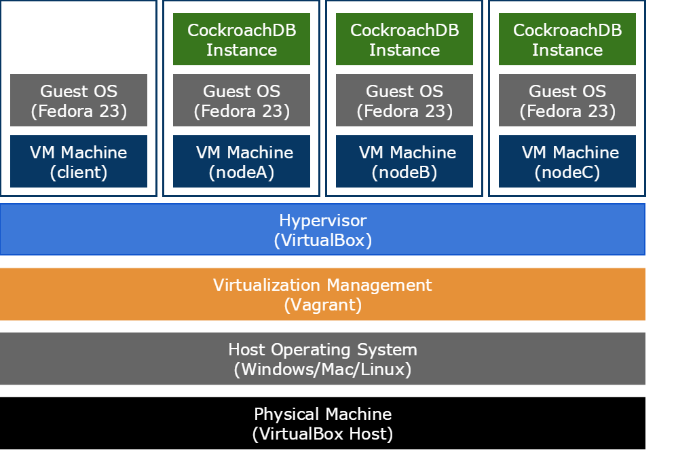
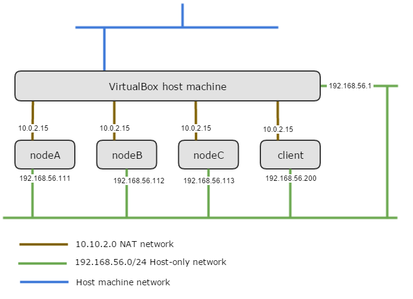
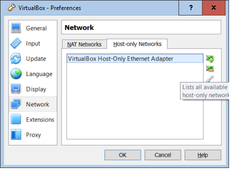
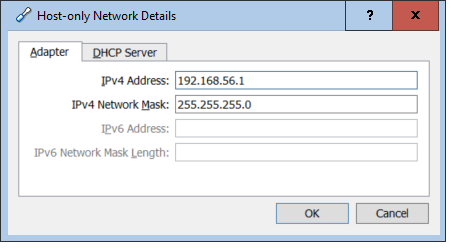

The logical architecture built using this guide looks like this. The diagram shows 3 of the possible 26 cluster nodes and a client machine that doesn’t run a CockroachDB instance but is used to connect to the cluster.

## Install VirtualBox
WindowsMacLinux

1.  Download and install the latest version of [VirtualBox](https://www.virtualbox.org/manual/ch06.html) onto your host machine. Accept all the default choices during install. This guide was created and tested using version 5.0.14 but should work with newer versions.

2.  The VirtualBox Extension Pack that is optionally installed on the host machine is not required for this guide but you can install it if you want to. The VirtualBox Guest Additions that are optionally install on the guest machines are required but their downloading and installation is handled by Vagrant.

## Configure VirtualBox
WindowsMacLinux

VirtualBox doesn’t require much configuration for the setup in this guide. The only consideration is the virtual networking requirements for the cluster.

### Network

Each VirtualBox machine requires two network interfaces configured.

This is because Vagrant requires the first network interface on any virtual machine to be of type NAT. While the NAT network provides external access from the guest machine (and access from the host to the guest via port forwarding), it doesn’t allow network communication between the guest machines. This guide uses the second network interface on each virtual machine to provide network connectivity between the CockroachDB virtual machine nodes and the host machine. The network configuration is designed so the cluster is not accessible from outside the host machine. See the [Introduction to networking modes](https://www.virtualbox.org/manual/ch06.html#networkingmodes) in the VirtualBox Documentation for more information.

The logical network looks like this:

1.  If you already had VirtualBox installed, check that you have a Host-only network adapter configured on the host. If this is a fresh install of VirtualBox, check that a Host-only network adapter is configured as below. On the host machine, using the VirtualBox Manager GUI, Select **File --> Preferences**, then in the VirtualBox - Settings window, select **Network**. In the Network pane, select the **Host-only Networks** tab and check you have an entry named **VirtualBox Host-Only Ethernet Adapter**.

2.  Select the edit host-only network icon and check in the Adapter tab that the entries are as below. If there is no adapter listed, add one with the details below. It's important that the Adapter's IPv4 Address is **192.168.56.1** so it will be on the same Host-only network as the cluster nodes. The DHCP Server doesn’t have to be enabled as the guide uses static IP address for the cluster nodes but it can be if you want to.

See the [Virtual networking chapter](https://www.virtualbox.org/manual/ch06.html) of the VirtualBox manual for more information.

### About VirtualBox and Guest Time Synchronization

There is no Linux based time synchronization service like `NTP` running on the cluster nodes to keep their time in sync. The VirtualBox Guest Additions ensure that the guest's system time is synchronized with the host time. Time synchronization is performed by the **VBoxService** process running on the guest machine.

It’s important that the CockroachDB machine nodes have as consistent time as possible. It’s more important that the time is consistent across the cluster nodes than absolutely accurate.

The default time synchronization settings in VirtualBox aren't really good enough to maintain adequate time consistency between the cluster nodes.

By default, the **VBoxService** process checks the time synchronization between the guest and the host every 10 seconds. If the time drift is more than 100 ms, it will adjust the time, otherwise it will just leave it as is unless the time is out by more than 20 minutes, then it will just reset the guests time to the hosts time.
If the drift is between 100 ms and 20 minutes it will adjust the time, however it will only do so only in small increments of around 5 ms each time. 

The implication of this configuration is that if the time is out by (say a relatively small) 250 ms, it could take up to 5 minutes before the drift is down to 100 ms. This is not ideal for a cluster of machines.

A better configuration would be:

* Check the time synchronization every 5 seconds `--timesync-interval 5000`
* Adjust the time if the drift is more than 50 ms `--timesync-min-adjust 50`
* Reset the time if the drift is more than 1 second `--timesync-set-threshold 1000`
* Set the time when starting the VBoxService process `--timesync-set-start`
* Set the time if the guest was restored from a saved state `--timesync-set-on-restore 1`

These time synchronization parameters are included in the `Vagrantfile` configuration file.

## What's Next?

Install [Vagrant](cockroach-vb-cluster_vagrant) on your host machine.
