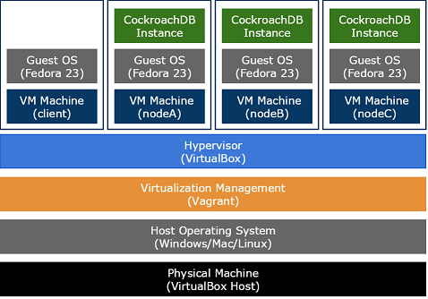

## What is CockroachDB?

(taken from the [CockroachDB FAQ](https://www.cockroachlabs.com/docs/frequently-asked-questions.html))

CockroachDB is a distributed SQL database built on a transactional and strongly-consistent key-value store. 

It **scales** horizontally; **survives** disk, machine, rack, and even datacenter failures with minimal latency disruption and no manual intervention; supports **strongly-consistent** ACID transactions; and provides a familiar **SQL** API for structuring, manipulating, and querying data.

CockroachDB is inspired by Google’s [Spanner](http://research.google.com/archive/spanner.html) and [F1](http://research.google.com/pubs/pub38125.html) technologies, and it’s completely [open source](https://github.com/cockroachdb/cockroach).

## What is this Guide?

This guide explains how to set up a demonstration or evaluation CockroachDB cluster using a single computer to host a number of virtual machines that run CockroachDB nodes.

It uses VirtualBox to create the guest machines and Vagrant to manage them.

You need to be connected to the Internet to build this cluster as it requires you to download and install some things but you don't need to be online to run the cluster.

## What's Next?

The [Introduction](cockroach-vb-cluster_introduction) section will take you through all the little things you need to get going. 
