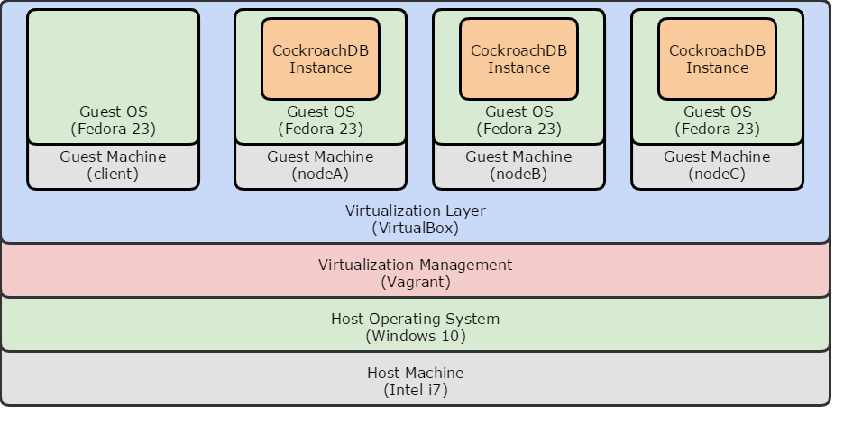
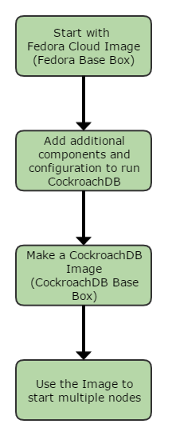

# Introduction

This guide will take you through the steps to configure a CockroachDB cluster on multiple VirtualBox machines using the Vagrant utility. At the end of the guide, you will have a working cluster of up to 26 nodes and a client machine from which you can connect to the cluster. Other than some basic tests to check things are working as expected, the cluster will be empty of any user data and will be ready to use. 
The approach is to get a working CockroachDB cluster consisting of multiple machines up and running as easily as possible on a single physical machine, while providing the ability to easily rebuild with new versions of the software.

## Overview

The logical architecture of the cluster looks like this. The diagram shows 3 of the possible 26 cluster nodes and a client machine that doesn’t run a CockroachDB instance but is used to connect to the cluster.

> The client machine is currently just another copy of a cluster node but it really should have a GUI interface so it can run the CockroachDB UI and not just the cockroach sql command line. It should have a Gnome desktop with a Chrome or Firefox browser. You can still run the CockroachDB UI from the host machine as it has direct access to the cluster network.

If you haven’t used VirtualBox or Vagrant before, I would recommend you read [Chapter 1. First Steps](https://www.virtualbox.org/manual/ch01.html) in the VirtualBox manual and the [Why Vagrant](https://www.vagrantup.com/docs/why-vagrant/index.html) section of the Vagrant documentation. This guide involves creating a new Vagrant base box which I consider to be an intermediate level task.

The basic approach is to start with a minimal base image then add the software and configuration to run an instance of CockroachDB. This machine is then packaged into a new Vagrant Box image that can be used to start multiple nodes. The guide uses the Fedora Cloud Vagrant image as it’s small and contains most of the pre-requisite software at the required versions.

### Intended Use

The cluster is designed for functional testing, evaluation and experimentation. It’s not a configuration that should be used for production data as all the nodes are on a single host and if you are going with virtual machines, a [type 1 hypervisor](https://en.wikipedia.org/wiki/Hypervisor) is a better choice for production. 

The setup does make concessions toward a production configuration in order to make it as close to what you would be using in real life, without making the configuration too complicated. Things like:

* Generates ssh key pairs and operates the cluster in “secure” mode.
* Uses a separate virtual machine for each CockroachDB instance instead of putting them all on one machine.
* Uses a client machine for connecting to the cluster and running database tasks. The client machine does not run an instance of CockroachDB.

The guide is written using a Windows 10 host machine but the instructions should easily be adapted for a Mac or Linux host and should work just as well. Some of the differences have been noted where applicable but using Mac OS/X or Linux as a host has not been tested.
