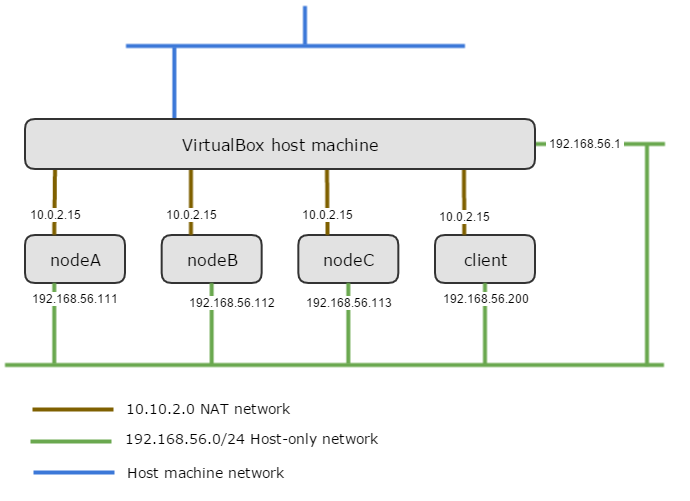
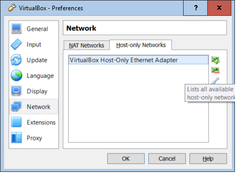
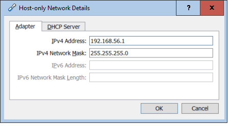

## VirtualBox

### Install VirtualBox

1. Download and install the latest version of [VirtualBox](https://www.virtualbox.org) onto your host machine. Accept all the default choices during install. This guide was created and tested using version 5.0.14 but should work with newer versions.

2. The VirtualBox Extension Pack that is optionally installed on the host machine is not required for this guide but you can install it if you want to. The VirtualBox Guest Additions that are optionally install on the guest machines are required but their downloading and installation is handled by Vagrant.

### Configure VirtualBox

VirtualBox doesn’t require much configuration for the setup in this guide. The only consideration is the virtual networking requirements for the cluster.

#### Network Configuration

Each VirtualBox machine requires two network interfaces configured. 

This is because Vagrant requires the first network interface on any virtual machine to be of type NAT. While the NAT network provides external access from the guest machine (and access from the host to the guest via port forwarding), it doesn’t allow network communication between the guest machines. This guide uses the second network interface on each virtual machine to provide network connectivity between the CockroachDB virtual machine nodes and the host machine. The network configuration is designed so the cluster is not accessible from outside the host machine. See the [Introduction to networking modes](https://www.virtualbox.org/manual/ch06.html#networkingmodes) in the VirtualBox Documentation for more information.

The logical network looks like this:

1. If you already had VirtualBox installed, check that you have a Host-only network adapter configured on the host. If this is a fresh install of VirtualBox, check that a Host-only network adapter is configured as below. On the host machine, using the VirtualBox Manager GUI, Select `File --> Preferences`, then in the **VirtualBox - Settings window**, select `Network`. In the **Network** pane, select the Host-only Networks tab and check you have an entry named VirtualBox Host-Only Ethernet Adapter. 

2. Select the edit host-only network icon and check in the Adapter tab that the entries are as below. If there is no adapter listed, add one with the details below. The DHCP Server doesn’t have to be enabled as the guide uses static IP address for the cluster nodes but it can be if you want to.

See the [Virtual networking](https://www.virtualbox.org/manual/ch06.html) chapter of the VirtualBox manual for more information.

